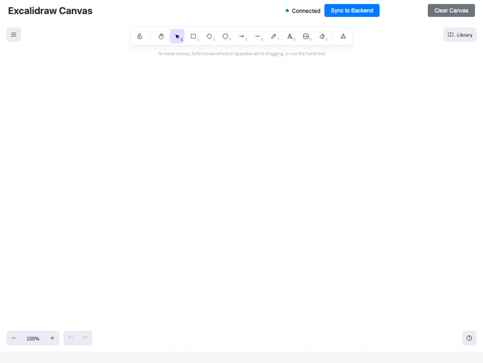
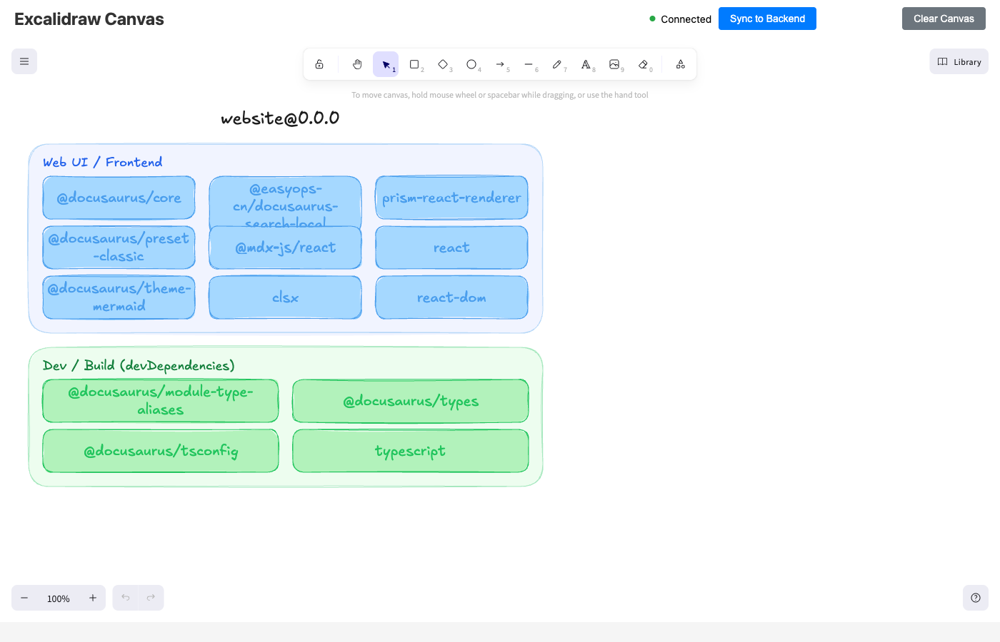
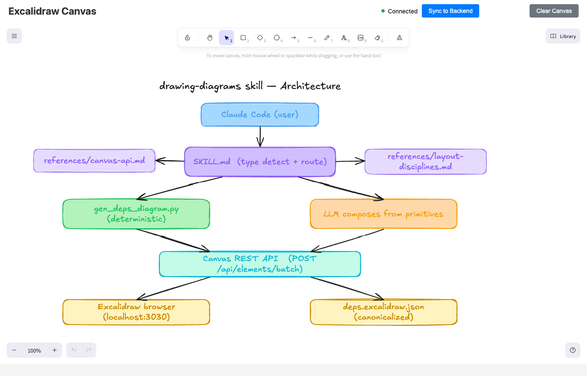
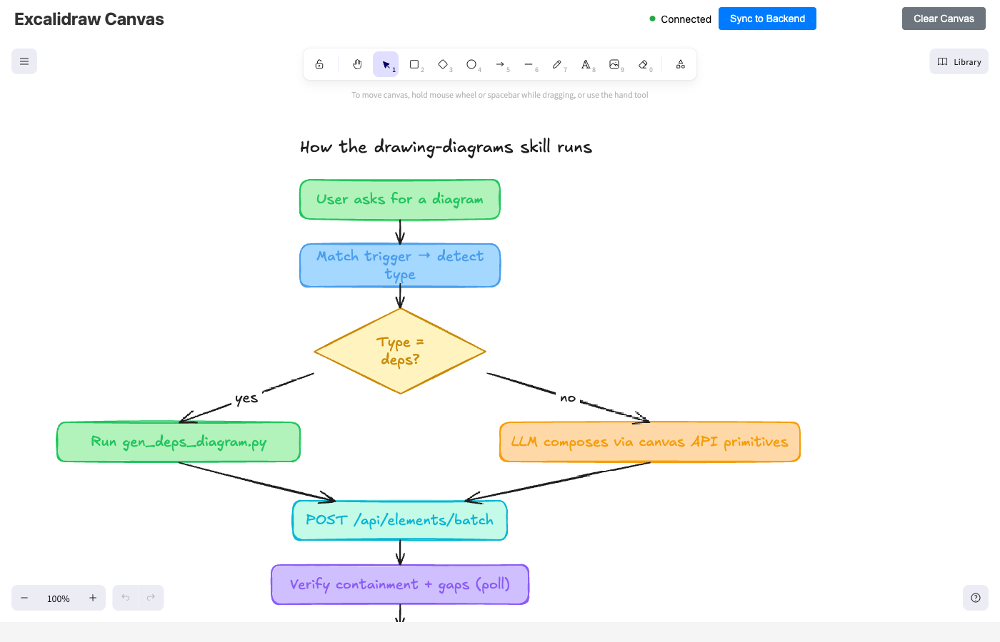

# drawing-diagrams — a Claude Code skill

> Render any diagram — architecture, dependency map, sequence, state machine, flowchart, data flow, ER — onto a live Excalidraw canvas, then export a canonicalized JSON snapshot. Two paths: **deterministic generators** for fact-based diagrams (dependency maps from `package.json`) and **LLM-driven composition** for synthesis diagrams.

Say *"draw the architecture of this repo"* or *"make a deps diagram for my package.json"* and Claude figures out the rest.

---

## What it looks like

Watch it build a dep map progressively (deterministic path, ~3 seconds end-to-end):



The completed dep map (docusaurus website, 13 deps across 2 zones):



The skill's own architecture, drawn by the skill (LLM-driven composition path):



The skill's execution flow as a flowchart (showcasing decision diamonds and convergence):



For the full architecture writeup, see **[ARCHITECTURE.md](ARCHITECTURE.md)**.

---

## Install

```bash
git clone https://github.com/must-mohsin1/drawing-diagrams.git ~/.claude/skills/drawing-diagrams
```

That's the skill installed. Now you need the canvas server (a one-time, separate install):

```bash
git clone https://github.com/yctimlin/mcp_excalidraw.git ~/mcp_excalidraw
cd ~/mcp_excalidraw && npm install && npm run build
```

And one Python dep (for the deterministic deps-map path):

```bash
pip3 install pyyaml
```

Restart Claude Code so it picks up the new skill. That's it.

---

## Use it

Open a new Claude Code session and just ask for a diagram. The skill triggers on phrases like:

| You say | Skill does |
|---|---|
| *"Draw a deps diagram for `~/my-app`"* | Categorizes `package.json` into 8 colored zones, draws on canvas, saves canonical JSON |
| *"Visualize the architecture of `~/projects/foo`"* | Reads source, picks modules, places them in a layered diagram |
| *"Sequence diagram for OAuth: browser → app → IdP → callback"* | Lifelines + numbered messages |
| *"Flowchart for our onboarding"* | Rectangles + diamonds for decisions |
| *"State machine for an Order: created → paid → shipped → delivered"* | Ellipses + transition arrows |
| *"Convert this mermaid to excalidraw: …"* | Passthrough via canvas API |
| *"Move the auth box left"* | Edits the existing canvas in-place |

Live canvas at `http://127.0.0.1:3030` — open it in a browser to watch the agent draw.

---

## Why this exists

There are AI diagram generators, but they tend to be **one-shot, stateless, and lossy**. This skill wires the [yctimlin/mcp_excalidraw](https://github.com/yctimlin/mcp_excalidraw) canvas server to a deterministic Python generator (for dep maps) **and** to a bundled reference library that teaches the LLM how to compose any diagram type from canvas primitives without rediscovering the layout gotchas every time:

- **Arrow binding** — `startBinding`/`endBinding` with `fixedPoint` is mandatory for diagonal arrows
- **Defensive sizing** — Excalidraw silently doubles a box height when its label wraps; zones must account for it
- **Cascade rule** — when a zone grows, the row below must shift; layouts are coupled, not independent
- **Race condition** — POST returns before WebSocket sync; poll-until-count-matches before snapshotting
- **Canonicalization** — strip volatile fields (timestamps, seeds, version nonces) for deterministic git diffs

All of this is encoded in `references/canvas-api.md` and `references/layout-disciplines.md`, which the skill explicitly tells the LLM to read before composing diagrams.

---

## What's inside

```
drawing-diagrams/
├── SKILL.md                              ← The skill itself — Claude reads this first
├── README.md                             ← This file
├── ARCHITECTURE.md                       ← Technical deep-dive — how it all works
├── LICENSE                               ← MIT
├── references/
│   ├── canvas-api.md                     ← REST endpoints, schemas, color palette, race-fix
│   └── layout-disciplines.md             ← Pitch, defensive sizing, cascade rule, checklist
├── scripts/
│   ├── gen_deps_diagram.py               ← Deterministic dep-map generator
│   └── dep_rules.yaml                    ← Categorization rules (regex-based, editable)
├── ci/
│   ├── .github/workflows/
│   │   └── diagram-refresh.yml           ← Drop into target repo for auto-PR on dep changes
│   └── simulate_ci.sh                    ← Local dry-run of the CI flow
└── screenshots/                          ← Example renderings (see top of README)
    ├── 01-dependency-map.png
    ├── 02-architecture.png
    └── 03-flowchart.png
```

---

## CI wiring (deps only, for now)

When you want your dep diagram to auto-refresh on every `package.json` change:

1. Copy `ci/.github/workflows/diagram-refresh.yml` into your target repo's `.github/workflows/`
2. Copy `scripts/gen_deps_diagram.py` + `scripts/dep_rules.yaml` into your target repo's `.ci/diagrams/`
3. Commit + push to `main`
4. CI runs on every relevant push, opens a PR if the diagram changed

Dry-run locally first to verify it works against your codebase:

```bash
~/.claude/skills/drawing-diagrams/ci/simulate_ci.sh ~/projects/my-app
```

---

## Customizing categorization

The deterministic dep-map path uses `scripts/dep_rules.yaml`. To add a new bucket (e.g., your codebase uses Remotion or Tauri and they keep landing in "Utils"):

```yaml
- id: video
  title: Video / Rendering
  color_zone_bg: "#ffd8a8"
  color_zone_stroke: "#dc2626"
  color_header: "#991b1b"
  color_box_bg: "#fecaca"
  color_box_stroke: "#dc2626"
  patterns:
    - "^remotion$"
    - "^@remotion/"
```

Buckets matched in declaration order. First match wins. Unmatched runtime deps fall through to `utils`; unmatched dev deps fall through to `dev`.

---

## Requirements

- macOS or Linux (Windows untested; should work via WSL)
- Node 18+ for the canvas server
- Python 3.7+ with PyYAML for the deterministic generator
- Claude Code installed and configured

---

## License

MIT — see [LICENSE](LICENSE).
